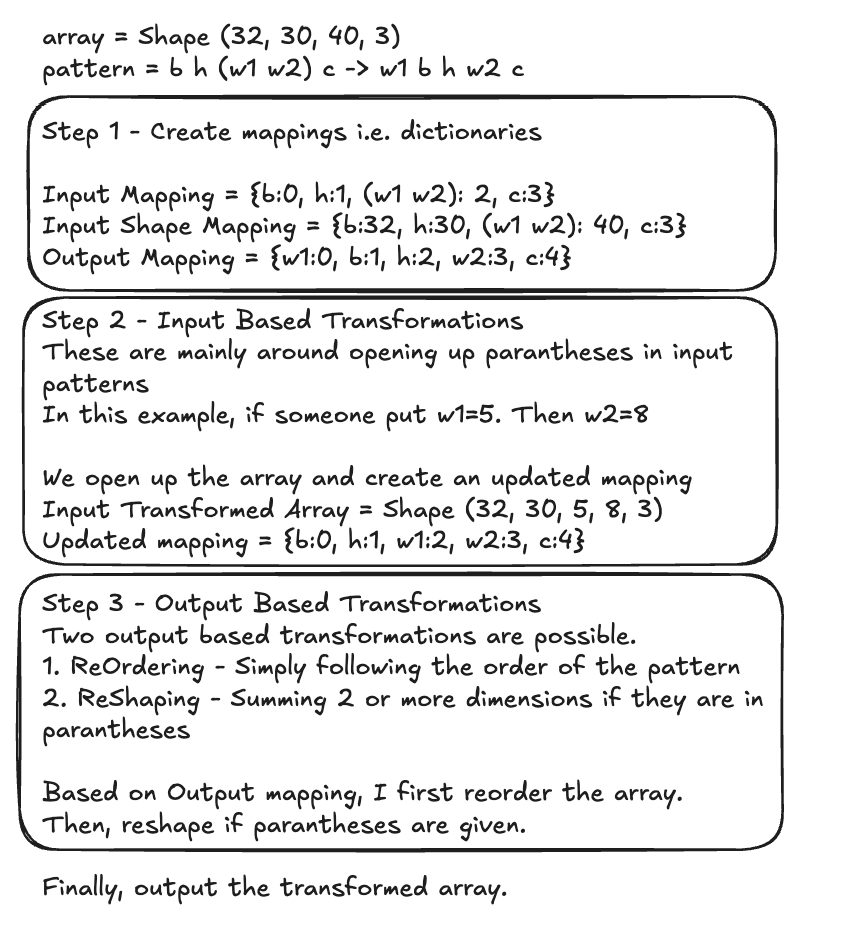

# Rearrange Function Implementation from Scratch

This repository contains a custom implementation of the `rearrange` function inspired by the `einops` library. The function allows flexible rearrangement of multi-dimensional arrays using a concise and expressive pattern syntax.

---

## High-Level Logic

### Overview
The `rearrange` function operates in the following logical steps:

1. **Validation**:
   - The input array and pattern are validated to ensure correctness.
   - Checks are performed for unexpected characters, duplicate dimensions, and proper ellipsis (`...`) handling.

2. **Mapping**:
   - Tokens in the input pattern are mapped to dimensions of the input array.
   - The output pattern is analyzed to determine the desired order and shape of the array.
   - Both mappings are saved as dictionaries i.e. input_token_mapping and output_token_mapping

3. **Input Pattern-based Transformation**:
   - The input array undergoes transformations based on the mapping of input tokens.
   - Intermediate transformations are applied to align the array's structure with the requirements of the output pattern.
   - These transformations are mainly focused on opening up paranthesis in the input pattern and creating a flattened transformation.
   - An updated mapping is created after conducting input based transformations.

4. **Output Construction**:
   - Singletons (dimensions of size 1) are added or removed as needed.
   - The array is re-ordered to match the output pattern.
   - If there is a paranthesis in the output pattern, array is reshaped accordingly.
 
5. **Finalization**:
   - The transformed array is returned in the desired format.

This is an explanation with an example that I created on Excalidraw. Someone introduced me to Excalidraw and I had a fun time playing around with it.



---

## Design Decisions

### Modularity
The implementation is designed to be modular, separating responsibilities into distinct classes and functions:

1. **Validator**:
   - Ensures the input array, pattern, and additional arguments are valid.
   - Contains methods to tokenize patterns, check for ellipses, and map input/output tokens to array dimensions and return as dictionaries.
   - Infer additional arguments based on the arguments provided, or throw an error.

2. **Input Transformations**:
   - Handles modifications to the input array based on the input pattern.
   - Updates mapping information after each transformation step.

3. **Output Transformations**:
   - Applies the desired rearrangement and reshaping logic to the input array.
   - Manages singleton dimensions and nested parentheses in the output pattern.

---

## Code Structure

### High-Level Flow
- **`rearrange` Function**: Orchestrates the entire process.
  1. Validates input.
  2. Processes extra arguments.
  3. Applies input transformations.
  4. Updates token mappings.
  5. Applies output transformations.

## Project Structure
```
- rearrange.py
  - Contains the main rearrange function.
- validators.py
  - Contains the validators function that check input for errors and create input and output pattern-based mappings.
- transformations.py
  - Input pattern-based transformations and output pattern-based transformations. All done using NumPy
- utils.py
  - Utility functions shared across both implementations.
- examples.py
  - Basic examples of how to call the custom made function
- tests/unit_test.py
  - Some unit tests for different parts, including testing multiple variants of the pattern.
```

---

## Error Handling
- **Invalid Patterns**: Clear error messages for unexpected characters, mismatched dimensions, or improper ellipsis usage.
- **Invalid Arguments**: Detailed validation ensures compatibility between the array and the pattern.

---

## Efficiency Tests

to-do

Want to compare the time taken to run custom implementation as compared to the function from the einops library.